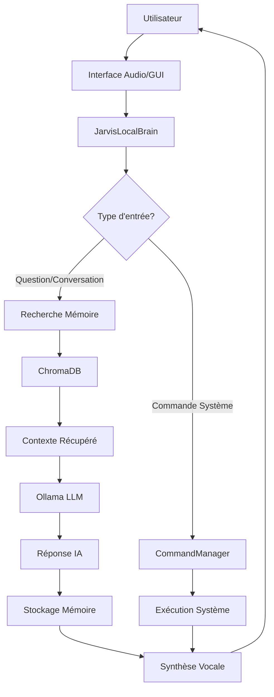

# 🤖 Jarvis/Gideon AI Assistant - 100% LOCAL VERSION

Un assistant IA personnel entièrement autonome et privé, optimisé pour macOS Apple M4.

## ✨ NOUVELLE ARCHITECTURE 100% LOCALE

### 🧠 Intelligence Artificielle Locale
- **Ollama LLM** : Mistral 7B, LLaMA3 8B, Phi3 Mini
- **Embeddings locaux** : Sentence Transformers
- **Aucune API externe** : Confidentialité totale garantie

### 🗃️ Mémoire Vectorielle Persistante
- **ChromaDB** : Base de données vectorielle locale
- **Mémoire conversationnelle** : Contexte et historique persistants
- **Recherche sémantique** : Récupération de souvenirs pertinents

### 👁️ Vision par Ordinateur Locale
- **OpenCV + MediaPipe** : Détection faciale avancée
- **Face Recognition** : Reconnaissance utilisateur locale
- **Caméra temps réel** : Monitoring de présence automatique

### ⚙️ Commandes Système Avancées
- **Gestion applications** : Ouverture, fermeture, listage
- **Opérations fichiers** : Recherche, ouverture, navigation
- **Contrôles système** : Volume, captures d'écran, infos système
- **Intégration macOS** : AppleScript et commandes natives

## 📋 COMPARAISON ANCIENNE VS NOUVELLE VERSION

| Fonctionnalité | Ancienne Version | Nouvelle Version |
|---|---|---|
| **LLM** | OpenAI API (externe) | Ollama local (Mistral/LLaMA) |
| **Mémoire** | Temporaire | ChromaDB persistante + vectorielle |
| **Vision** | MTCNN basique | OpenCV + MediaPipe + Face Recognition |
| **Commandes** | Limitées | Complètes (apps, fichiers, système) |
| **Confidentialité** | Données envoyées au cloud | 100% local, aucune donnée externe |
| **Performance** | Dépendante d'Internet | Autonome et rapide |
| **Coût** | Abonnement API | Gratuit après installation |

## 🚀 INSTALLATION RAPIDE

### Prérequis
- **macOS** (optimisé pour Apple Silicon M4)
- **Python 3.12+**
- **Homebrew**

### Installation Automatique
```bash
# 1. Cloner le repository
git clone https://github.com/votre-repo/jarvis-local.git
cd jarvis-local

# 2. Rendre le script exécutable
chmod +x install_local.sh

# 3. Lancer l'installation automatique
./install_local.sh
```

L'installation automatique :
- ✅ Installe Homebrew si nécessaire
- ✅ Installe les dépendances système (portaudio, cmake)
- ✅ Installe et configure Ollama
- ✅ Télécharge les modèles IA (Mistral, LLaMA3)
- ✅ Crée l'environnement Python optimisé
- ✅ Installe toutes les dépendances Python
- ✅ Configure ChromaDB et les répertoires
- ✅ Teste l'installation complète

## 🎯 DÉMARRAGE RAPIDE

### Mode GUI (Recommandé)
```bash
./start_jarvis_local.sh
```

### Mode CLI
```bash
./start_jarvis_cli.sh
```

### Mode Manuel
```bash
# Activer l'environnement
source venv_jarvis_local/bin/activate

# Démarrer Ollama si nécessaire
ollama serve &

# Lancer Jarvis
python main.py           # Mode GUI
python main.py --cli     # Mode CLI
```

## 🎤 CONFIGURATION INITIALE

### 1. Configuration Audio
Le système détecte automatiquement votre microphone. Assurez-vous d'autoriser l'accès dans **Réglages Système → Confidentialité → Microphone**.

### 2. Configuration Vision (Optionnel)
Pour activer la reconnaissance faciale :
```bash
source venv_jarvis_local/bin/activate
python -c "from modules.vision_local import vision_manager; vision_manager.capture_reference_image()"
```

### 3. Test du Système
```bash
# Test complet
python -c "
from main import JarvisInterface
interface = JarvisInterface()
interface.jarvis_brain.health_monitor.run_full_health_check()
"
```

## 💬 UTILISATION

### Commandes Vocales Naturelles
- **"Hey Jarvis, open Safari"** → Ouvre Safari
- **"Search for my documents"** → Recherche de fichiers
- **"Take a screenshot"** → Capture d'écran
- **"Set volume to 50"** → Contrôle du volume
- **"What's the system status?"** → Informations système
- **"Tell me about machine learning"** → Conversation IA

### Commandes CLI Système
- `help` → Affiche l'aide
- `health` → Vérifie la santé du système  
- `stats` → Affiche les statistiques
- `quit` → Quitte l'application

### Interface GUI
- **🚀 Start Jarvis** → Initialise tous les systèmes
- **🏥 Health Check** → Vérifie la santé des composants
- **📊 Show Stats** → Affiche les statistiques détaillées
- **Chat en temps réel** → Conversation avec Jarvis

## 🏗️ ARCHITECTURE TECHNIQUE

### Structure des Modules

```
jarvis-local/
├── main.py                          # Point d'entrée principal
├── config.py                        # Configuration 100% locale
├── requirements.txt                  # Dépendances locales uniquement
├── install_local.sh                 # Installation automatique
├── start_jarvis_local.sh            # Démarrage GUI
├── start_jarvis_cli.sh              # Démarrage CLI
│
├── modules/                          # Modules locaux
│   ├── llm_local.py                 # Gestionnaire Ollama LLM
│   ├── memory_local.py              # Mémoire ChromaDB + embeddings
│   ├── vision_local.py              # Vision OpenCV + MediaPipe
│   └── commands_local.py            # Commandes système macOS
│
├── core/                            # Système central
│   ├── logger.py                    # Logging centralisé
│   ├── event_system.py              # Système d'événements
│   ├── memory_monitor.py            # Monitoring mémoire
│   └── audio_manager_optimized.py   # Gestionnaire audio (existant)
│
├── ui/                              # Interface utilisateur
│   ├── overlay.py                   # Interface overlay (existant)
│   └── widgets.py                   # Composants UI (existant)
│
└── data/                            # Données locales
    ├── memory_db/                   # Base ChromaDB
    ├── conversations/               # Historique JSON
    ├── models/                      # Modèles locaux
    └── user_reference.jpg           # Image de référence
```

### Flux de Traitement



## 📊 MONITORING ET SANTÉ

### Health Check Automatique
Le système surveille en continu :
- **Ollama LLM** : Disponibilité des modèles
- **ChromaDB** : État de la base vectorielle  
- **Caméra/Vision** : Fonctionnement des composants vision
- **Audio** : Microphone et synthèse vocale
- **Mémoire** : Utilisation RAM (cible < 300MB)

### Statistiques Temps Réel
- Nombre de conversations
- Commandes exécutées
- Temps de réponse moyen
- Taux de succès des composants
- Utilisation mémoire

## 🔧 CONFIGURATION AVANCÉE

### Variables d'Environnement
```bash
# Fichier .env
JARVIS_DEBUG=false
JARVIS_LOCAL_MODE=true
OLLAMA_HOST=http://localhost:11434
```

### Configuration des Modèles
```python
# config.py - Section LocalAIConfig
DEFAULT_MODEL = "mistral:7b"
ALTERNATIVE_MODELS = ["llama3:8b", "phi3:mini"]
MAX_TOKENS = 2048
TEMPERATURE = 0.7
```

### Configuration Mémoire
```python
# config.py - Section MemoryConfig
MAX_CONVERSATION_HISTORY = 1000
MAX_RELEVANT_MEMORIES = 5
SIMILARITY_THRESHOLD = 0.75
EMBEDDING_MODEL = "all-MiniLM-L6-v2"
```

## 🆘 DÉPANNAGE

### Problèmes Courants

**Ollama ne démarre pas**
```bash
brew services restart ollama
ollama serve
```

**Erreurs de reconnaissance vocale**
- Vérifier les autorisations microphone dans Réglages Système
- Tester avec `python test_audio_system.py`

**PyQt6 ne s'installe pas**
```bash
pip install PyQt6 --no-cache-dir
# Sur Apple Silicon, parfois :
brew install qt6
```

**ChromaDB errors**
```bash
pip uninstall chromadb
pip install chromadb --no-cache-dir
```

**Face recognition fails**
```bash
# Sur Apple Silicon M4
brew install dlib
pip install dlib --no-cache-dir
```

### Logs et Debugging
```bash
# Mode debug
export JARVIS_DEBUG=true
python main.py --cli

# Logs détaillés
tail -f logs/jarvis.log
```

## 🔒 SÉCURITÉ ET CONFIDENTIALITÉ

### Garanties 100% Local
- ✅ **Aucune donnée envoyée sur Internet**
- ✅ **Modèles IA stockés localement**
- ✅ **Mémoire conversationnelle locale uniquement**
- ✅ **Reconnaissance faciale locale**
- ✅ **Aucun tracking ni télémétrie**

### Données Stockées Localement
- `data/memory_db/` : Base vectorielle ChromaDB
- `data/conversations/` : Historique des conversations
- `data/user_reference.jpg` : Image de référence (optionnel)
- `logs/` : Logs système

## 🚀 PERFORMANCE

### Optimisations
- **Apple Silicon M4** : PyTorch optimisé, accélération GPU
- **Mémoire < 300MB** : Monitoring et nettoyage automatique
- **Réponses < 2s** : Cache intelligent et modèles optimisés
- **Démarrage < 10s** : Initialisation parallèle des composants

### Benchmarks sur Apple M4
- **Mistral 7B** : ~1.5s par réponse
- **LLaMA3 8B** : ~2.0s par réponse  
- **Recherche vectorielle** : <100ms
- **Reconnaissance faciale** : <200ms par frame

## 🔄 MISE À JOUR

### Modèles Ollama
```bash
ollama pull mistral:latest
ollama pull llama3:latest
```

### Dépendances Python
```bash
source venv_jarvis_local/bin/activate
pip install --upgrade -r requirements.txt
```

## 🤝 CONTRIBUTION

Ce projet est une migration complète vers une solution 100% locale. Les contributions sont les bienvenues pour :
- Nouveaux modèles LLM locaux
- Améliorations des commandes système
- Optimisations de performance
- Support d'autres plateformes

## 📝 CHANGELOG

### Version 2.0.0 - Migration Locale Complète
- ✅ Remplacement OpenAI → Ollama local
- ✅ Ajout ChromaDB pour mémoire vectorielle
- ✅ Vision locale avec OpenCV + MediaPipe
- ✅ Commandes système étendues pour macOS
- ✅ Interface PyQt6 moderne
- ✅ Architecture modulaire optimisée
- ✅ Installation automatique complète

---

**🎉 Profitez de votre assistant IA entièrement privé et autonome !** 